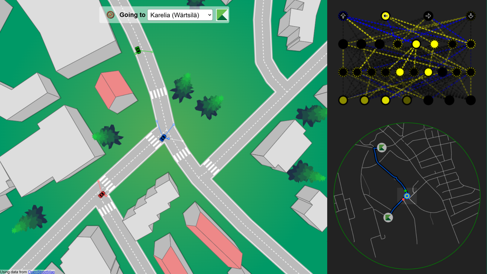

# 🚗 NeuraDrive
## Neural Network-Based Autonomous Car with Web UI

NeuraDrive is a cutting-edge autonomous car simulation built entirely with vanilla JavaScript 🌐, without external libraries. It combines neural networks with a dynamic Web UI to demonstrate self-driving capabilities in a virtual environment.



## 🔑 Key Features
- 🧠 Neural Network-Based Decision Making
- ⏰ Real-Time Simulation in the Browser
- 🎯 Dropdown Menu to Dynamically Change the Car's Destination
- 🛞 Button for Enabling Manual Driving Mode
- 🌦️ Map with Seasonal Environments that Adapt According to the Current Month
- 🌍 Map Data Based on **OpenStreetMap (OSM)**
- ⚡ Lightweight, No External Libraries
- 🌐 Interactive Web UI for Visualizing the Car's Journey

## 🛠️ How It Works
NeuraDrive leverages a feedforward neural network to control the car's steering and speed based on sensor inputs. The map dynamically changes according to the current month, offering realistic seasonal environments. The geographical data is sourced from **OpenStreetMap (OSM)** to create accurate and detailed map layouts.

### Architecture
- 🔌 **Input Layer**: Sensor distances
- ⚙️ **Hidden Layers**: Configurable neurons
- 🚥 **Output Layer**: Steering angle & throttle

### Training Process
The neural network is optimized using genetic algorithms 🧬, where the best-performing agents evolve over generations.

## 🎯 Usage
1. Clone the repository:
   ```bash
   git clone https://github.com/ArchitJ6/NeuraDrive.git
   cd NeuraDrive
   ```
2. Open `index.html` in your browser.
3. Select your destination from the dropdown 📍.
4. Click the 🛞 button to enable manual driving mode.
5. Watch the car navigate the world autonomously!

## 🌐 User Interface Overview
- 📍 Dropdown Menu to Select the Destination
- 🔥 Real-Time Visualization of Decision Boundaries
- 🧠 Neural Network Architecture Visualization
- 🌦️ Seasonal Map Changes
- 🌍 OSM-Based Map Rendering
- 🛞 Toggle for Manual Driving Mode

## 📄 File Structure
```
CAR/
├─ car.js
├─ carInfo.js
├─ controls.js
├─ decisionBoundary.js
├─ main.js
├─ miniMap.js
├─ multiDecisionBoundary.js
├─ network.js
├─ road.js
├─ sensor.js
├─ style.css
├─ utils.js
├─ visualizer.js
├─ index.html
└─ new_nn/
   ├─ nn.js
   └─ nnEditor.js
├─ imgs/

WORLD/
├─ js/
│  ├─ editors/
│  │  ├─ crossingEditor.js
│  │  ├─ graphEditor.js
│  │  ├─ lightEditor.js
│  │  ├─ markingEditor.js
│  │  ├─ parkingEditor.js
│  │  ├─ startEditor.js
│  │  ├─ stopEditor.js
│  │  ├─ targetEditor.js
│  │  └─ yieldEditor.js
│  ├─ items/
│  │  ├─ building.js
│  │  ├─ tree.js
│  │  └─ water.js
│  ├─ markings/
│  │  ├─ crossing.js
│  │  ├─ light.js
│  │  ├─ marking.js
│  │  ├─ parking.js
│  │  ├─ start.js
│  │  ├─ stop.js
│  │  ├─ target.js
│  │  └─ yield.js
│  ├─ math/
│  │  ├─ graph.js
│  │  ├─ osm.js
│  │  └─ utils.js
│  ├─ primitives/
│  │  ├─ envelope.js
│  │  ├─ point.js
│  │  ├─ polygon.js
│  │  └─ segment.js
├─ grid.js
├─ viewport.js
├─ world.js
└─ saves/
   └─ many_targets_small.world

index.html
```

## 🧑‍💻 Contributing
Contributions are welcome! Fork the project and submit your pull requests.

## 📜 License
This project is licensed under the **MIT License**.